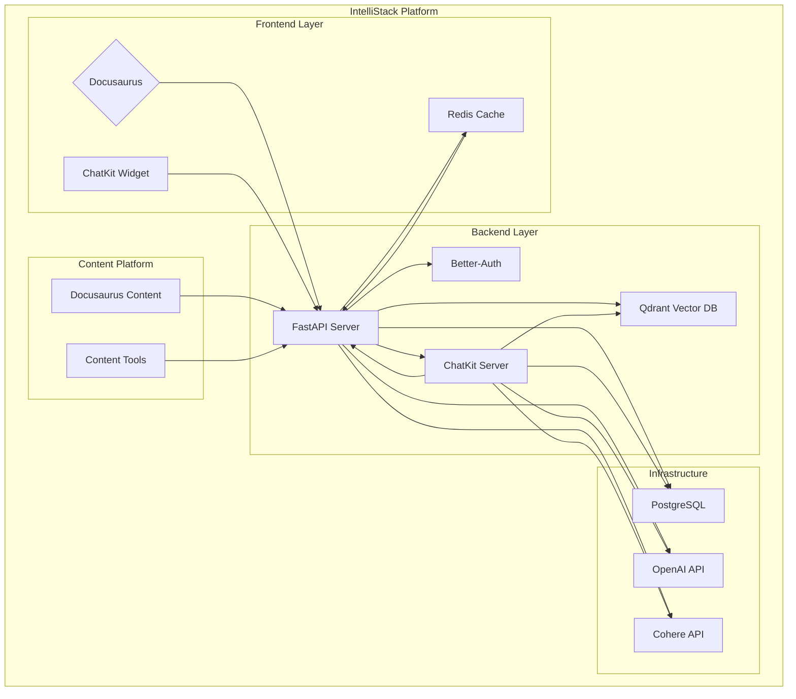

# IntelliStack Platform

> AI-Native Learning Platform for Physical AI & Humanoid Robotics Education

IntelliStack is a comprehensive learning management system designed for Physical AI & Humanoid Robotics education. The platform combines progressive learning paths, AI-powered tutoring, RAG chatbot with citations, content authoring tools, institution management, and community features to deliver a cutting-edge educational experience.

[](https://github.com/your-username/intellistack)
[](LICENSE)
[](https://www.python.org/)
[](https://fastapi.tiangolo.com/)

## Table of Contents

- [Key Features](#key-features)
- [Architecture Overview](#architecture-overview)
- [Getting Started](#getting-started)
- [Project Structure](#project-structure)
- [Features and Functionality](#features-and-functionality)
- [Development Setup](#development-setup)
- [API Documentation](#api-documentation)
- [Contributing](#contributing)
- [Tech Stack](#tech-stack)
- [License](#license)
- [Links and Resources](#links-and-resources)

## Key Features

### 🤖 **AI-Powered Learning**
- **Socratic AI Tutor**: Uses the Socratic method for guided learning without direct answers
- **RAG Chatbot**: Vector search-powered chatbot with citations and source passage viewer
- **Progressive Learning Path**: 5-stage structured progression from Foundations to Capstone

### 📚 **Content Management**
- **5-Stage Learning Path**: Foundations → ROS 2 & Simulation → Perception & Planning → AI Integration → Capstone
- **Content Authoring**: MDX editor with preview and version history with diff viewer
- **Review Workflow**: Draft → In Review → Published content lifecycle
- **Stage-Based Access**: Prerequisite-based unlocking of content

### 🏫 **Institution Management**
- **Cohort Management**: Create and manage learning groups with enrollment limits
- **Instructor Assignment**: Assign instructors to cohorts with proper permissions
- **Analytics Dashboard**: Track progress and engagement metrics
- **Webhook Notifications**: Event-driven notifications with retry logic

### 🔄 **Progress Tracking**
- **Multi-Level Tracking**: Progress monitoring at lesson, exercise, and assessment levels
- **Badge System**: Achievement-based recognition for student accomplishments
- **Certificate Generation**: Automated certificate creation upon completion

### 🌐 **Community Features**
- **Study Groups**: Collaborative learning environments
- **Forums**: Discussion platforms for peer learning
- **Mentorship Programs**: Connect students with industry experts

**Current Status**: 74.5% Complete (38/51 tasks, 6/7 phases implemented)

## Architecture Overview

### High-Level Architecture



### Component Breakdown

1. **Backend Service** (`intellistack/backend/`)
   - **Framework**: FastAPI (Python 3.11+)
   - **ORM**: SQLAlchemy 2.0 (async)
   - **Database**: PostgreSQL (Neon)
   - **API Documentation**: Automatic OpenAPI/Swagger generation
   - **ChatKit Integration**: AI tutoring with streaming responses

2. **Auth Server** (`intellistack/auth-server/`)
   - **Framework**: Better-Auth (TypeScript)
   - **Protocol**: OIDC compliant authentication
   - **Tokens**: JWT-based session management

3. **Content Platform** (`intellistack/content/`)
   - **Framework**: Docusaurus (React-based)
   - **Format**: MDX content with interactive elements
   - **Search**: Built-in search capabilities
   - **ChatKit Widget**: AI tutoring interface with text selection support

4. **ChatKit AI Tutor**
   - **Frontend**: Floating chat widget with context awareness
   - **Backend**: Server with SSE streaming and rate limiting
   - **Features**: RAG integration, stage-based access control, conversation history
   - **API**: `/api/v1/chatkit` endpoints with streaming support

### Technology Stack

| Layer | Technology | Purpose |
|-------|------------|---------|
| **Backend** | FastAPI + SQLAlchemy | API server and ORM |
| **Authentication** | Better-Auth | OIDC-compliant auth |
| **Database** | PostgreSQL | Relational data storage |
| **Vector DB** | Qdrant | RAG chatbot data |
| **Cache** | Redis | Performance optimization |
| **AI/ML** | OpenAI API, LangChain, Cohere | LLM integration |
| **Frontend** | Docusaurus, React | Content delivery |
| **Infrastructure** | Docker, Docker Compose | Containerization |
| **Simulation** | Gazebo, NVIDIA Isaac Sim | Robotics simulation |

## Getting Started

### Prerequisites

- **Docker** (v20.10+)
- **Docker Compose** (v2.0+)
- **Node.js** (v18+)
- **Python** (v3.11+)
- **Git** (v2.0+)
- **NVIDIA Container Toolkit** (for GPU support)

### Quick Start

1. **Clone the repository**:
   ```bash
   git clone https://github.com/your-username/intellistack.git
   cd intellistack
   ```

2. **Set up environment variables**:
   ```bash
   # Copy environment files
   cp intellistack/backend/.env.example intellistack/backend/.env
   cp intellistack/auth-server/.env.example intellistack/auth-server/.env
   ```

3. **Build and start services**:
   ```bash
   # Start development environment
   docker-compose -f intellistack/docker-compose.dev.yml up --build
   ```

4. **Initialize database**:
   ```bash
   # Run database migrations
   docker-compose -f intellistack/docker-compose.dev.yml exec backend alembic upgrade head
   ```

5. **Access the platform**:
   - **Backend API**: http://localhost:8000
   - **Backend Docs**: http://localhost:8000/docs
   - **Auth Server**: http://localhost:3000
   - **Content Platform**: http://localhost:3001

### Configuration

1. **Environment Variables**:
   - `POSTGRES_URL`: PostgreSQL connection string
   - `QDRANT_URL`: Qdrant vector database URL
   - `OPENAI_API_KEY`: OpenAI API key for RAG features
   - `COHERE_API_KEY`: Cohere API key for reranking
   - `JWT_SECRET`: JWT signing secret
   - `REDIS_URL`: Redis cache connection string

2. **Database Setup**:
   ```bash
   # Run migrations to set up tables
   cd intellistack/backend && alembic upgrade head
   ```

## Project Structure

```
C:\Users\saram\OneDrive\Desktop\physicalhumoniodbook\
├── intellistack/              # Main application code
│   ├── backend/               # FastAPI backend (Python)
│   │   ├── src/
│   │   │   ├── main.py        # Application entry point
│   │   │   ├── config/
│   │   │   │   └── settings.py # Configuration settings
│   │   │   ├── core/
│   │   │   │   ├── auth/       # Authentication logic
│   │   │   │   ├── content/    # Content management
│   │   │   │   ├── learning/   # Learning path logic
│   │   │   │   └── chat/       # RAG chatbot
│   │   │   ├── shared/
│   │   │   │   └── database.py # Database setup
│   │   │   └── tests/          # Test files
│   │   ├── alembic/           # Database migrations
│   │   ├── Dockerfile         # Backend container config
│   │   └── requirements.txt   # Python dependencies
│   ├── auth-server/           # Better-Auth OIDC server (TypeScript)
│   │   ├── src/
│   │   │   ├── index.ts       # Server entry point
│   │   │   └── auth.ts        # Auth configuration
│   │   ├── Dockerfile         # Auth container config
│   │   └── package.json       # Node.js dependencies
│   ├── content/               # Docusaurus content platform
│   │   ├── docs/              # Documentation files
│   │   ├── src/
│   │   │   └── pages/         # Custom pages
│   │   ├── docusaurus.config.ts # Docusaurus configuration
│   │   └── package.json       # Frontend dependencies
│   ├── specs/                 # Feature specifications (SDD)
│   │   └── 001-intellistack-platform/
│   │       ├── spec.md        # Feature requirements
│   │       ├── plan.md        # Architecture decisions
│   │       └── tasks.md       # Implementation tasks
│   ├── .specify/              # SpecKit Plus templates
│   │   ├── memory/            # Project constitution
│   │   ├── scripts/           # Utility scripts
│   │   └── templates/         # Document templates
│   ├── history/               # Prompt History Records (PHRs)
│   │   └── prompts/           # Conversation history
│   ├── docker-compose.yml     # Production Docker config
│   ├── docker-compose.dev.yml # Development Docker config
│   ├── CLAUDE.md              # Development guidelines
│   └── PROJECT_STATUS.md      # Current implementation status
```

### Key Entry Points

- **Backend API**: `intellistack/backend/src/main.py`
- **Auth Server**: `intellistack/auth-server/src/index.ts`
- **Content Platform**: `intellistack/content/docusaurus.config.ts`
- **Specification**: `specs/001-intellistack-platform/spec.md`
- **Project Status**: `PROJECT_STATUS.md`

## Features and Functionality

### 5-Stage Learning Path

The platform implements a progressive learning approach with 5 distinct stages:

1. **Foundations** - Core concepts and prerequisites
2. **ROS 2 & Simulation** - Robot operating system and simulation environments
3. **Perception & Planning** - Computer vision, sensor fusion, and path planning
4. **AI Integration** - Machine learning model integration and deployment
5. **Capstone** - Final project combining all learned concepts

Each stage has prerequisite requirements and unlocks progressively as students complete previous stages.

### RAG Chatbot Capabilities

The Retrieval-Augmented Generation (RAG) chatbot provides:

- **OpenAI Integration**: SSE streaming for real-time responses
- **Qdrant Vector Store**: Hybrid retrieval with semantic search
- **Text Chunking**: Token-based splitting (512 tokens, 50 overlap)
- **Cohere Reranking**: Improved result relevance (rerank-v3.5)
- **Citations**: Source passage viewer with citations
- **Stage-Based Access**: Only searches content that students have unlocked
- **Text Selection Queries**: Context-aware searching

### ChatKit AI Tutor

The ChatKit AI Tutor provides an advanced learning experience with:

- **Socratic Method**: Guides students without giving direct answers
- **Floating Widget**: Context-aware chat interface in Docusaurus content
- **Text Selection Integration**: Students can select text and ask about specific content
- **Conversation History**: Thread management with message persistence
- **Rate Limiting**: Usage control with daily message limits
- **Stage-Based Access**: Context-aware responses based on student progression
- **Real-time Streaming**: Server-Sent Events for smooth conversational flow
- **RAG Integration**: Full access to the knowledge base with citations

### Content Authoring System

Content creation tools include:

- **MDX Editor**: Rich content editor with live preview
- **Version Control**: Complete version history with diff viewer
- **Review Workflow**: Structured review process (draft → in_review → published)
- **Content Ingestion**: Automated content processing pipeline

### Institution Management

Administrative features include:

- **Cohort Creation**: Enrollable learning groups with enrollment limits
- **Instructor Assignment**: Role-based access control for educators
- **Webhook Notifications**: Event-driven system with retry logic
- **Analytics Aggregation**: Comprehensive reporting and metrics

## Development Setup

### Local Development Environment

1. **Prerequisites Installation**:
   ```bash
   # Install Docker Desktop (includes Docker Compose)
   # Install Node.js (LTS version)
   # Install Python 3.11+
   # Install Git
   ```

2. **Environment Configuration**:
   ```bash
   # Navigate to project directory
   cd C:\Users\saram\OneDrive\Desktop\physicalhumoniodbook\

   # Set up backend environment
   cd intellistack/backend
   python -m venv venv
   source venv/bin/activate  # On Windows: venv\Scripts\activate
   pip install -r requirements.txt

   # Set up auth server environment
   cd ../auth-server
   npm install

   # Set up content platform environment
   cd ../content
   npm install
   ```

3. **Database Migrations**:
   ```bash
   # From backend directory
   cd intellistack/backend
   alembic upgrade head
   ```

### Development Modes

**Development Mode**:
```bash
# Start all services in development mode
docker-compose -f docker-compose.dev.yml up --build

# Or run services individually
docker-compose -f docker-compose.dev.yml up backend auth-server content-platform
```

**Hot Reloading**:
- Backend: Changes to Python code automatically reload
- Auth Server: TypeScript changes trigger live reload
- Content: MDX content changes update immediately

### Testing

**Backend Tests**:
```bash
# Run backend tests
cd intellistack/backend
python -m pytest tests/ -v

# Run with coverage
python -m pytest tests/ --cov=src/ --cov-report=html
```

**Integration Tests**:
```bash
# Run integration tests
docker-compose -f docker-compose.test.yml up --build
```

## API Documentation

### Main API Endpoints

| Method | Endpoint | Description |
|--------|----------|-------------|
| `GET` | `/api/health` | Health check endpoint |
| `POST` | `/api/auth/login` | User authentication |
| `GET` | `/api/learning/stages` | Get available learning stages |
| `GET` | `/api/learning/stages/{id}` | Get specific stage details |
| `POST` | `/api/learning/progress` | Update learning progress |
| `GET` | `/api/content/lessons` | Get available lessons |
| `GET` | `/api/chat/stream` | Stream RAG chat responses |
| `GET` | `/api/institutions/cohorts` | Get institution cohorts |
| `POST` | `/api/content/create` | Create new content |
| `POST` | `/api/chatkit/stream` | Stream AI tutor responses |
| `GET/POST/DELETE` | `/api/chatkit/threads` | Manage conversation threads |
| `GET` | `/api/chatkit/usage` | Get rate limit usage |

### Authentication

All API endpoints require JWT authentication via the Better-Auth service:

1. **Login**: `POST /api/auth/login` to get session token
2. **API Calls**: Include `Authorization: Bearer <token>` header
3. **Token Refresh**: Automatic token refresh for active sessions

### API Versioning

The API follows semantic versioning:

- **Base URL**: `https://api.intellistack.com/v1/`
- **Version Header**: `API-Version: 1.0.0`
- **Backward Compatibility**: Major versions may introduce breaking changes

## Contributing

### Development Workflow

1. **Fork the Repository**:
   ```bash
   git clone https://github.com/your-username/intellistack.git
   cd intellistack
   git checkout -b feature/your-feature-name
   ```

2. **Follow Spec-Driven Development** (SDD):
   - Create specifications in `specs/<feature>/spec.md`
   - Document architecture in `specs/<feature>/plan.md`
   - Define tasks in `specs/<feature>/tasks.md`
   - Create Prompt History Records (PHRs) in `history/prompts/`

3. **Code Style**:
   - **Python**: Follow PEP 8 with Black formatting
   - **TypeScript**: Use ESLint with TypeScript rules
   - **Documentation**: Use clear, concise language

4. **Commit Guidelines**:
   ```bash
   git add .
   git commit -m "feat(learning): add progress tracking for exercises

   - Implement progress tracking at lesson, exercise, assessment level
   - Add badge issuance for completed modules
   - Update API endpoints to support progress updates

   Co-Authored-By: Your Name <your.email@example.com>"
   ```

### Branch Naming Conventions

- **Feature**: `feature/<feature-name>` (new functionality)
- **Bug Fix**: `fix/<bug-description>` (bug fixes)
- **Documentation**: `docs/<topic>` (documentation updates)
- **Refactor**: `refactor/<description>` (code improvements)
- **Chore**: `chore/<description>` (maintenance tasks)

### Code Review Process

1. **Pull Request Requirements**:
   - All tests must pass
   - Code coverage must not decrease
   - Follow all style guidelines
   - Include relevant documentation updates

2. **Review Criteria**:
   - Code quality and maintainability
   - Performance considerations
   - Security implications
   - Documentation completeness

## Tech Stack

### Backend Technologies

- **Framework**: FastAPI (Python 3.11+)
  - Async-first design with excellent performance
  - Automatic API documentation generation
  - Pydantic for data validation

- **Database**: PostgreSQL (Neon)
  - Production-ready SQL database
  - Advanced features for complex queries
  - Neon's serverless capabilities

- **ORM**: SQLAlchemy 2.0 (async)
  - Modern async ORM for Python
  - Type-safe database operations
  - Alembic for migrations

- **Caching**: Redis
  - Session storage and caching
  - Rate limiting and temporary data
  - Pub/Sub for real-time features

### Authentication & Security

- **Better-Auth**: Modern authentication framework
  - OIDC compliant
  - JWT token management
  - Multi-provider support

- **Security Features**:
  - Rate limiting
  - Input validation
  - SQL injection protection
  - XSS protection

### AI & Machine Learning

- **OpenAI API**: Primary LLM integration
  - GPT models for chatbot responses
  - Embeddings for vector search
  - Function calling capabilities

- **LangChain/LangGraph**: LLM orchestration
  - Prompt templates
  - Chain management
  - Agent creation

- **Cohere**: Re-ranking capabilities
  - rerank-v3.5 model
  - Improved search result relevance
  - Semantic similarity matching

### Infrastructure & Deployment

- **Docker**: Containerization
  - Multi-stage builds
  - Resource optimization
  - Environment consistency

- **GPU Support**: NVIDIA Container Toolkit
  - CUDA support for ML workloads
  - GPU acceleration for vector operations
  - Optimized performance

### Frontend & Documentation

- **Docusaurus**: Documentation platform
  - Static site generation
  - Search functionality
  - Multi-language support

- **React**: Interactive components
  - Component-based architecture
  - State management
  - Performance optimization

## License

MIT License - see the [LICENSE](LICENSE) file for details.

## Links and Resources

### Project Documentation
- [Feature Specification](specs/001-intellistack-platform/spec.md)
- [Architecture Plan](specs/001-intellistack-platform/plan.md)
- [Task Tracking](specs/001-intellistack-platform/tasks.md)
- [Project Status](PROJECT_STATUS.md)

### Development Resources
- [FastAPI Documentation](https://fastapi.tiangolo.com/)
- [Better-Auth Documentation](https://better-auth.com/docs)
- [Docusaurus Documentation](https://docusaurus.io/)
- [Qdrant Documentation](https://qdrant.tech/documentation/)

### Community Links
- [GitHub Issues](https://github.com/your-username/intellistack/issues)
- [Discussions](https://github.com/your-username/intellistack/discussions)
- [Support](mailto:support@intellistack.org)

---

<p align="center">Built with ❤️ for the future of robotics education</p>