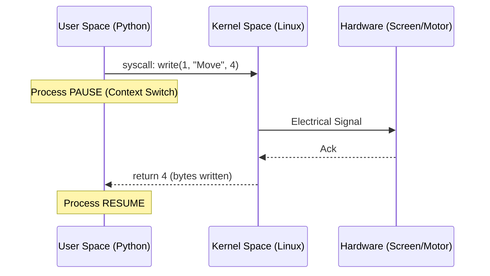

# 1.1 The Digital Nervous System
**Stage I: The Substrate**

> "To understand the robot, you must first understand the ground it walks on. In the digital world, that ground is the Kernel."

## 1. The Theory of Existence (Kernel vs. User Space)

In the beginning, there was only the **CPU**. It had infinite power but zero inhibition. It could write to any memory address, halt any process, and access any hardware. This is the **Ring 0** of reality—absolute monarchy.

But absolute power is dangerous. If a single robot control script crashed while running in Ring 0, it would take down the entire machine. Motion would freeze. Safety checks would fail. The robot would fall.

To solve this, we invented the **Schism of Privilege**:

1.  **Kernel Space (Ring 0)**: The Autonomic Nervous System. It handles breathing (scheduling), blood flow (memory paging), and senses (hardware drivers). It creates the *illusion* of a continuous reality for processes.
2.  **User Space (Ring 3)**: The Conscious Mind. This is where your code lives. It is a sandbox. It cannot touch hardware directly; it must *ask* the Kernel.

### The System Call (The Synapse)

How does the Conscious Mind (User Space) move a physical muscle (Hardware)? It cannot just "reach out". It must send a chemical signal across the gap. This signal is the **System Call** (`syscall`).

When your Python script runs `print("Hello")`, it is not printing. It is generating a `write()` syscall, handing a payload of bytes to the Kernel, and pausing its own existence until the Kernel confirms the message was delivered to the stdout file descriptor.



### Thought Experiment: The Frozen Time
Imagine you are writing a `while True:` loop to read a sensor.
```python
while True:
    data = sensor.read()  # Blocking Call
```
The naive view is that your code "waits" at line 2.
The **Deep Theory** view is that your process *ceases to exist*.

1.  The `read()` syscall tells the Kernel: "I have no purpose until data arrives on File Descriptor 3."
2.  The Kernel marks your process state as `INTERRUPTIBLE_SLEEP`.
3.  It removes your process from the Run Queue.
4.  Your code is effectively dead. It consumes zero CPU cycles.
5.  Microseconds later, electrons hit the UART buffer. The Hardware interrupts the Kernel.
6.  The Kernel sees who was waiting for FD 3, wakes up your process, and time resumes.

This is why we can run 1000 processes on a 4-core CPU. Most of them are "dead" most of the time, waiting for the physical world to happen.

---

## 2. The Axiom: Everything is a File

Unix philosophy makes a radical claim: **Reality is a Stream of Bytes.**

If you can `read()` from a file, you can `read()` from a socket.
If you can `write()` to a file, you can `write()` to a motor controller.

### The File Descriptor (FD)
An FD is just an integer. It is an index in an array `fd_array` kept by the Kernel for each process.

*   `0`: stdin (The ear)
*   `1`: stdout (The mouth)
*   `2`: stderr (The conscience)
*   `3+`: Connections to the world (Files, Sockets, Pipes)

### Deep Code: Investigating the Illusion
Let's verify this theory by looking at the raw file descriptors of a running process.

```bash
# 1. Start a persistent process that opens a file
python3 -c "import time; f = open('test.txt', 'w'); time.sleep(1000)" &
[1] 12345  # <--- This is the PID

# 2. Look into the /proc filesystem (The Kernel's window)
ls -l /proc/12345/fd/

# Output:
# lrwx------ 0 user 0 -> /dev/pts/0  (stdin - 0)
# lrwx------ 1 user 1 -> /dev/pts/0  (stdout - 1)
# lrwx------ 2 user 2 -> /dev/pts/0  (stderr - 2)
# l-wx------ 3 user 3 -> /home/user/test.txt (Our file!)
```

This reveals the truth: The process doesn't "have" the file. It has a *reference* (`3`) to a resource managed by the Kernel.

---

## 3. The Process Scheduler (The Heartbeat)

If the Kernel is the brain, the **Scheduler** is the heart. It decides who gets to live (run on CPU) and for how long.

### CFS: Completely Fair Scheduler
Standard Linux uses a "Red-Black Tree" to track which process has been "unfairly" treated (starved of CPU time). The process with the *least* runtime (left-most node in the tree) is picked next.

This is great for fairness, but **terrible** for Robotics.

### The Real-Time Problem
A robot falling over takes 50ms.
If the Scheduler decides to let the "Log Compressor" process run for 100ms because it was "starved", your robot falls.
Fairness is not what we want. We want **Determinism**.

### PREEMPT_RT
This is why we use Real-Time Kernels. They allow us to say: "I don't care about fairness. This Balance Controller thread is King."

We achieve this with **Priorities** and **Preemption**.
A high-priority thread can *interrupt* a lower-priority thread instantly (preempt it), even if the lower one is in the middle of a syscall.

---

## Deep FAQ

> **Q: Why not just run everything in Kernel Space for speed?**
> A: This is called a Unikernel. Some embedded systems do this. But you lose the safety net. A memory leak in your code becomes a memory leak in the OS. In complex robotics (Vision + Control + Planning), the risk is too high. We trade microseconds of context-switching cost for the reliability of isolated processes.

> **Q: What is a Zombie Process?**
> A: A process that has died (executed `exit()`) but its parent has not yet read its exit code (via `wait()`). It is a corpse left in the process table. The Kernel keeps it there so the parent can know *how* it died. If the parent never checks, the zombie haunts the RAM forever.
