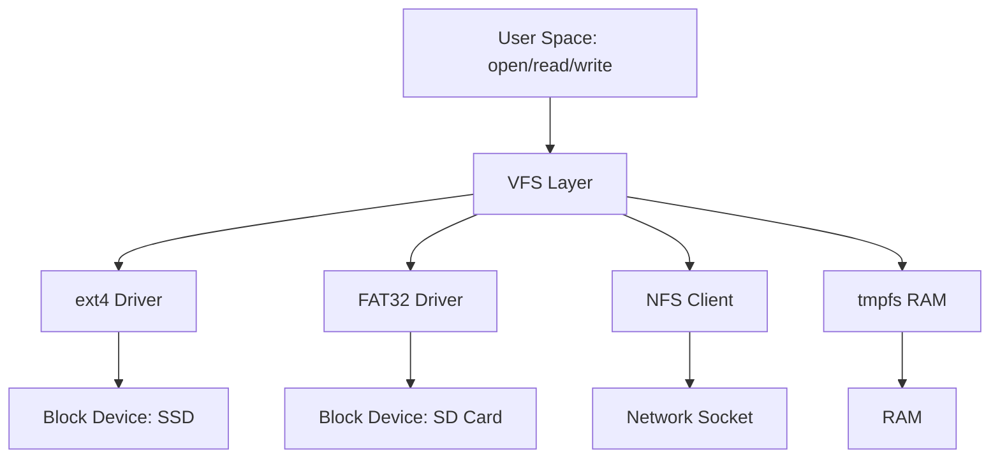
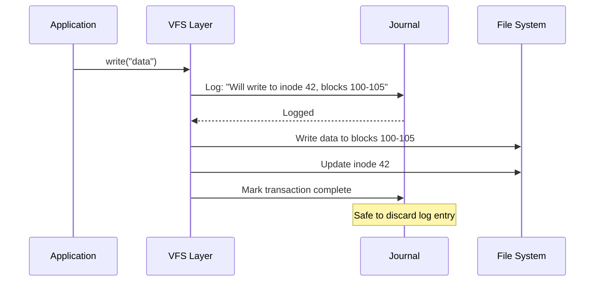

# 1.2 The File System: Reality as a Tree

<details>
<summary>📋 Chapter Summary</summary>

**Key Concepts**: VFS (Virtual File System), inodes, ext4, journaling, mount points

**What You'll Learn**:
- Understand how Linux abstracts different file systems through VFS
- Explain the inode data structure and its role in file management
- Describe how journaling prevents data corruption
- Apply file system knowledge to robotics sensor data logging

**Prerequisites**: Basic Linux command line, Chapter 1.1 (Kernel theory)

**Time Estimate**: 50 minutes (35 min reading + 15 min exercises)

</details>

---

## 1. The Illusion of Unity: VFS

In robotics, you might log sensor data to an SD card (FAT32), stream video to a network drive (NFS), and read configuration from a USB stick (ext4). Yet your code uses the same `open()`, `read()`, `write()` calls.

This is the **Virtual File System (VFS)** - Linux's greatest abstraction.



### The Contract

VFS defines a **contract**: "If you want to be a file system, implement these operations:"

```c
struct file_operations {
    ssize_t (*read)(struct file *, char __user *, size_t, loff_t *);
    ssize_t (*write)(struct file *, const char __user *, size_t, loff_t *);
    int (*open)(struct inode *, struct file *);
    int (*release)(struct inode *, struct file *);
    // ... 30+ more operations
};
```

When you call `read()` in Python, the Kernel:
1. Looks up which file system owns that file descriptor
2. Calls that file system's `read()` implementation
3. Returns the result to you

**Why This Matters for Robotics:**
- You can swap storage backends (SD card → SSD) without changing code
- You can log to RAM (`tmpfs`) for speed, then flush to disk
- You can mount network drives for remote data collection

---

## 2. The Inode: The Soul of a File

In Linux, a file is **not** its name. The name is just a pointer.

The **inode** (index node) is the actual file. It contains:
- File size
- Permissions (rwx)
- Owner (UID/GID)
- Timestamps (created, modified, accessed)
- **Pointers to data blocks** (where the actual bytes live)

### The Separation of Name and Data

```python live
# Let's explore inodes
import os
import stat

# Create a test file
with open('robot_log.txt', 'w') as f:
    f.write('Sensor reading: 42')

# Get inode information
file_stat = os.stat('robot_log.txt')

print(f"Inode number: {file_stat.st_ino}")
print(f"Size: {file_stat.st_size} bytes")
print(f"Permissions: {oct(stat.S_IMODE(file_stat.st_mode))}")
print(f"Owner UID: {file_stat.st_uid}")
print(f"Modified: {file_stat.st_mtime}")

# Create a hard link (another name for the same inode)
os.link('robot_log.txt', 'sensor_backup.txt')

# Both names point to the SAME inode
print(f"\nOriginal inode: {os.stat('robot_log.txt').st_ino}")
print(f"Hard link inode: {os.stat('sensor_backup.txt').st_ino}")
print("They are the same!")

# Cleanup
os.remove('robot_log.txt')
os.remove('sensor_backup.txt')
```

### Hard Links vs Symbolic Links

**Hard Link**: Another name for the same inode. Deleting one name doesn't delete the file until ALL names are gone.

**Symbolic Link (Symlink)**: A special file that contains a path string. It's a pointer to a name, not an inode.

```bash
# Hard link: Same inode
ln robot_log.txt backup.txt

# Symbolic link: Different inode, contains path
ln -s robot_log.txt shortcut.txt
```

**Robotics Use Case:**
- Hard links for atomic log rotation (old and new names point to same data)
- Symlinks for configuration management (`current_config.yaml` → `config_v2.yaml`)

---

## 3. ext4: The Workhorse File System

**ext4** (Fourth Extended File System) is the default on most Linux systems. It's battle-tested, fast, and reliable.

### Key Features

1. **Journaling** - Crash recovery (explained below)
2. **Extents** - Efficient storage of large files
3. **Delayed Allocation** - Better performance for writes
4. **Online Defragmentation** - Reduce fragmentation without unmounting

### The Anatomy of ext4

```
┌─────────────────────────────────────────────────────┐
│                  ext4 File System                    │
├─────────────────────────────────────────────────────┤
│ Superblock (metadata about the file system)         │
├─────────────────────────────────────────────────────┤
│ Block Group 0                                        │
│  ├─ Block Bitmap (which blocks are free/used)       │
│  ├─ Inode Bitmap (which inodes are free/used)       │
│  ├─ Inode Table (array of inodes)                   │
│  └─ Data Blocks (actual file contents)              │
├─────────────────────────────────────────────────────┤
│ Block Group 1                                        │
│  ├─ Block Bitmap                                     │
│  ├─ Inode Bitmap                                     │
│  ├─ Inode Table                                      │
│  └─ Data Blocks                                      │
├─────────────────────────────────────────────────────┤
│ ... (more block groups)                              │
└─────────────────────────────────────────────────────┘
```

### Block Size Trade-offs

ext4 uses fixed-size blocks (typically 4KB). This creates a trade-off:

- **Small blocks (1KB)**: Less wasted space for small files, but more overhead
- **Large blocks (4KB)**: Better for large files, but wastes space for small files

**Robotics Consideration:**
- Sensor logs (small, frequent writes) → 1KB blocks
- Video recordings (large, sequential writes) → 4KB blocks

---

## 4. Journaling: The Safety Net

Imagine your robot crashes mid-write. The file system is in an inconsistent state:
- Inode says file is 1MB
- Only 500KB of data blocks are written
- Block bitmap says blocks are allocated, but they're empty

**Journaling** solves this by writing changes to a **journal** (log) before applying them to the file system.

### How Journaling Works



### Journaling Modes

1. **journal** - Log both metadata AND data (slowest, safest)
2. **ordered** - Log metadata, write data before metadata (default, good balance)
3. **writeback** - Log metadata, write data anytime (fastest, least safe)

**Robotics Choice:**
- Critical control logs → `journal` mode
- Sensor telemetry → `ordered` mode (default)
- Debug logs → `writeback` mode (speed over safety)

---

## 5. Mount Points: Stitching Reality Together

In Linux, everything is part of a single tree starting at `/`. But different parts of the tree can live on different devices.

```bash
# Show mounted file systems
mount | grep -E "^/dev"

# Example output:
# /dev/sda1 on / type ext4 (rw,relatime)
# /dev/sdb1 on /data type ext4 (rw,relatime)
# /dev/sdc1 on /mnt/usb type vfat (rw,relatime)
```

### The Mount Process

```python live
# Simulate understanding mount points
import os

# In real Linux, you'd use: mount /dev/sdb1 /data
# This requires root privileges, so we'll simulate

mount_info = {
    '/': {'device': '/dev/sda1', 'fstype': 'ext4'},
    '/data': {'device': '/dev/sdb1', 'fstype': 'ext4'},
    '/mnt/usb': {'device': '/dev/sdc1', 'fstype': 'vfat'},
}

def find_mount_point(path):
    """Find which mount point a path belongs to"""
    # Start from the path and walk up until we find a mount point
    current = os.path.abspath(path)
    while current != '/':
        if current in mount_info:
            return current, mount_info[current]
        current = os.path.dirname(current)
    return '/', mount_info['/']

# Test
test_paths = ['/home/user/code', '/data/logs', '/mnt/usb/config.yaml']
for path in test_paths:
    mount, info = find_mount_point(path)
    print(f"{path} → mounted at {mount} ({info['device']}, {info['fstype']})")
```

**Robotics Pattern:**
- `/` - Root file system (OS, binaries)
- `/data` - Sensor logs, recordings (separate partition for safety)
- `/mnt/usb` - Configuration files (hot-swappable)

---

## 6. Practical Robotics: Sensor Data Logging

Let's apply file system knowledge to a real robotics problem: **high-frequency sensor logging**.

### The Problem

You have a LiDAR sensor producing 10,000 points/second. Each point is 12 bytes (x, y, z as floats). That's **120 KB/s** of data.

Naive approach:
```python
# BAD: Opens and closes file for every point
for point in lidar_stream:
    with open('lidar.log', 'a') as f:
        f.write(f"{point.x},{point.y},{point.z}\n")
```

**Why This Is Terrible:**
- Each `open()` is a syscall (context switch)
- Each `write()` might trigger a disk flush
- File system metadata updates on every write

### The Solution: Buffered Writes

```python live
import time
import struct

class SensorLogger:
    def __init__(self, filename, buffer_size=1024*1024):  # 1MB buffer
        self.file = open(filename, 'wb')
        self.buffer = bytearray()
        self.buffer_size = buffer_size

    def log_point(self, x, y, z):
        # Pack as binary (12 bytes per point)
        self.buffer.extend(struct.pack('fff', x, y, z))

        # Flush when buffer is full
        if len(self.buffer) >= self.buffer_size:
            self.flush()

    def flush(self):
        if self.buffer:
            self.file.write(self.buffer)
            self.buffer.clear()

    def close(self):
        self.flush()
        self.file.close()

# Simulate logging
logger = SensorLogger('lidar_test.bin')

start = time.time()
for i in range(10000):
    logger.log_point(i * 0.1, i * 0.2, i * 0.3)
end = time.time()

logger.close()

print(f"Logged 10,000 points in {end - start:.3f} seconds")
print(f"File size: {10000 * 12} bytes (120 KB)")

# Cleanup
import os
os.remove('lidar_test.bin')
```

**Key Optimizations:**
1. **Binary format** - 12 bytes vs ~30 bytes for CSV
2. **Buffered writes** - Reduce syscalls from 10,000 to ~10
3. **Sequential writes** - File system can optimize for sequential I/O

---

## 7. Advanced: Direct I/O and O_SYNC

For ultra-low-latency logging (e.g., control loop data), you can bypass the kernel's page cache:

```python
import os

# Open with O_DIRECT flag (bypass page cache)
# Note: Requires aligned buffers and block-sized writes
fd = os.open('control.log', os.O_WRONLY | os.O_CREAT | os.O_DIRECT)

# Or use O_SYNC to force immediate disk writes
fd = os.open('critical.log', os.O_WRONLY | os.O_CREAT | os.O_SYNC)
```

**Trade-offs:**
- `O_DIRECT` - Faster for large sequential writes, but requires careful buffer alignment
- `O_SYNC` - Guarantees data is on disk, but much slower

**When to Use:**
- Control loop logs → `O_SYNC` (safety over speed)
- Video recordings → `O_DIRECT` (speed, can tolerate loss)
- Telemetry → Standard buffered I/O (balance)

---

## Deep FAQ

**Q: What happens if I delete a file that's currently open?**

A: The file's name (directory entry) is removed, but the inode and data blocks remain until the last file descriptor is closed. This is why you can delete a log file while a process is writing to it - the process keeps writing to the inode.

```bash
# Terminal 1: Start writing to a file
python3 -c "import time; f = open('test.log', 'w'); f.write('data'); time.sleep(60)"

# Terminal 2: Delete the file
rm test.log  # File disappears from directory

# Terminal 1: Process still has the file open!
# Data blocks are freed only when the process exits
```

**Q: Why does `df` show different free space than `du`?**

A: `df` reports file system free space (including reserved blocks). `du` reports actual disk usage. The difference includes:
- Reserved blocks (5% for root by default)
- Deleted files still open by processes
- File system metadata overhead

**Q: How do I choose between ext4, XFS, and Btrfs for robotics?**

A:
- **ext4** - Default choice, proven reliability, good all-around performance
- **XFS** - Better for large files (video recordings), excellent parallel I/O
- **Btrfs** - Snapshots and compression, but less mature (use for development, not production)

**Recommendation:** ext4 for root, XFS for `/data` if you have large video files.

---

## Exercises

### Exercise 1: Inode Investigation
```bash
# Create a file and explore its inode
echo "test" > myfile.txt
stat myfile.txt  # View inode info
ls -i myfile.txt  # Show inode number

# Create hard link and verify same inode
ln myfile.txt hardlink.txt
ls -i myfile.txt hardlink.txt

# Create symlink and verify different inode
ln -s myfile.txt symlink.txt
ls -i myfile.txt symlink.txt
```

### Exercise 2: Buffered vs Unbuffered Writes
Modify the `SensorLogger` class to add a `sync_mode` parameter. Compare performance:
- Buffered (default)
- Unbuffered (`flush()` after every write)
- O_SYNC mode

Measure the time difference for 10,000 writes.

### Exercise 3: Mount Point Discovery
Write a Python function that takes a file path and returns:
- The mount point it belongs to
- The device name
- The file system type
- The mount options (rw, ro, etc.)

Hint: Parse `/proc/mounts`

---

## Further Reading

- [ext4 Documentation](https://www.kernel.org/doc/html/latest/filesystems/ext4/index.html)
- [VFS Layer Internals](https://www.kernel.org/doc/html/latest/filesystems/vfs.html)
- [Linux File System Hierarchy](https://refspecs.linuxfoundation.org/FHS_3.0/fhs/index.html)

---

**Next Chapter:** [1.3 Process Management & Scheduling](./1-3-process-management.md)
**Related:** [1.1 Linux & OS Theory](./1-1-linux-theory.md) | [1.4 Networking Fundamentals](./1-4-networking.md)
