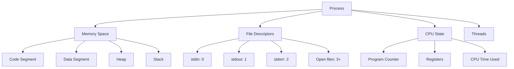
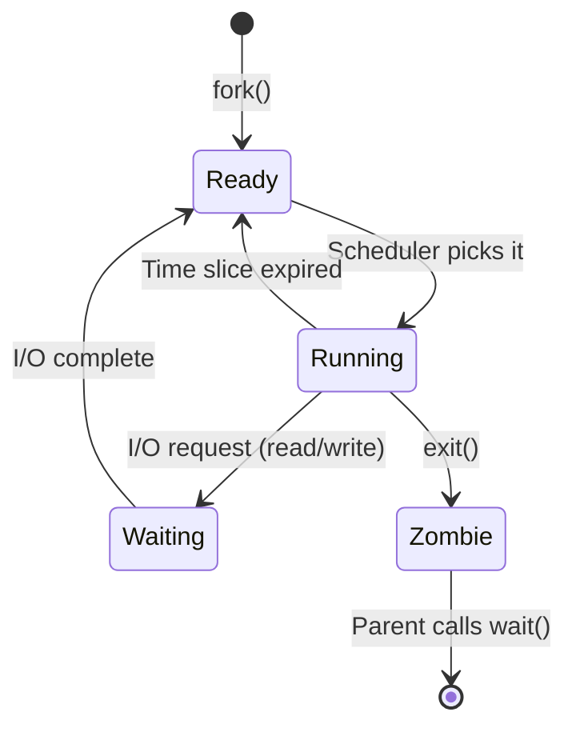
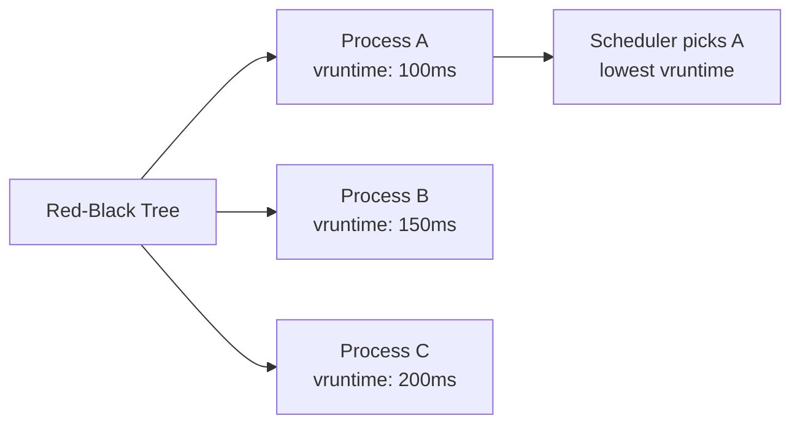

# 1.3 Process Management & Scheduling

<details>
<summary>📋 Chapter Summary</summary>

**Key Concepts**: Process lifecycle, fork/exec, CFS scheduler, Real-Time scheduling, PREEMPT_RT, priority inversion

**What You'll Learn**:
- Understand how processes are created (fork/exec) and destroyed
- Explain the difference between CFS and Real-Time scheduling
- Apply real-time priorities to robotics control loops
- Debug process issues using Linux tools

**Prerequisites**: Chapter 1.1 (Kernel theory), Chapter 1.2 (File systems)

**Time Estimate**: 55 minutes (40 min reading + 15 min exercises)

</details>

---

## 1. The Process: A Universe in Isolation

A **process** is an instance of a running program. It's a complete universe with:
- Its own memory space (virtual address space)
- Its own file descriptors
- Its own CPU registers
- Its own execution state



### Process vs Thread

- **Process**: Heavy isolation, separate memory space, expensive to create
- **Thread**: Lightweight, shared memory space, cheap to create

**Robotics Pattern:**
- Separate processes for: Vision, Planning, Control (isolation for safety)
- Threads within Control process for: Sensor reading, Motor commands, Safety checks (shared state)

---

## 2. The Birth of a Process: fork() and exec()

In Unix, there's only ONE way to create a process: **fork()**.

`fork()` creates an exact copy of the current process. The child process gets:
- A copy of the parent's memory
- A copy of the parent's file descriptors
- A copy of the parent's CPU state

```python live
import os
import time

print(f"Parent process PID: {os.getpid()}")

# Fork creates a child process
pid = os.fork()

if pid == 0:
    # This code runs in the CHILD process
    print(f"  Child process PID: {os.getpid()}")
    print(f"  Child's parent PID: {os.getppid()}")
    time.sleep(1)
    print("  Child exiting...")
else:
    # This code runs in the PARENT process
    print(f"Parent created child with PID: {pid}")
    print("Parent waiting for child...")
    os.waitpid(pid, 0)  # Wait for child to finish
    print("Parent: Child has exited")
```

### The Magic of fork()

`fork()` returns **twice**:
- In the parent: Returns child's PID
- In the child: Returns 0

This is how you distinguish parent from child.

### exec(): Replacing the Process

After `fork()`, the child is an exact copy of the parent. To run a different program, use `exec()`:

```python
import os

pid = os.fork()

if pid == 0:
    # Child process
    print("Child: About to exec...")
    os.execvp('ls', ['ls', '-l'])  # Replace child with 'ls' command
    # This line never executes (process is replaced)
    print("This never prints")
else:
    # Parent process
    os.waitpid(pid, 0)
    print("Parent: Child finished")
```

**The fork/exec Pattern:**
1. `fork()` - Create child process
2. Child calls `exec()` - Replace child with new program
3. Parent calls `wait()` - Wait for child to finish

This is how your shell runs commands!

---

## 3. Process States: The Lifecycle

A process transitions through several states during its lifetime:



### State Descriptions

1. **Ready (R)**: Process is ready to run, waiting for CPU
2. **Running (R)**: Process is currently executing on CPU
3. **Waiting/Sleeping (S/D)**:
   - **S (Interruptible Sleep)**: Waiting for I/O, can be interrupted by signals
   - **D (Uninterruptible Sleep)**: Waiting for I/O, cannot be interrupted (usually disk I/O)
4. **Zombie (Z)**: Process has exited, but parent hasn't read exit status yet
5. **Stopped (T)**: Process stopped by signal (e.g., Ctrl+Z)

### Viewing Process States

```python live
import subprocess
import os

# Get current process state
result = subprocess.run(['ps', '-o', 'pid,state,comm', '-p', str(os.getpid())],
                       capture_output=True, text=True)
print("Current process state:")
print(result.stdout)

# Show all processes with their states
result = subprocess.run(['ps', 'aux'], capture_output=True, text=True)
lines = result.stdout.split('\n')[:10]  # First 10 processes
print("\nFirst 10 processes:")
for line in lines:
    print(line)
```

---

## 4. The Scheduler: Who Gets to Run?

The **scheduler** decides which process runs next. Linux has two main scheduling classes:

### 4.1 CFS: Completely Fair Scheduler (Default)

CFS tries to give every process an equal share of CPU time. It uses a **Red-Black Tree** to track which process has been "unfairly" treated.

**Algorithm:**
1. Track how much CPU time each process has used (`vruntime`)
2. Pick the process with the **lowest** `vruntime` (left-most node in tree)
3. Run it for a time slice
4. Update its `vruntime`
5. Repeat



**Why CFS is Bad for Robotics:**
- Fairness ≠ Determinism
- A low-priority log compressor can delay your control loop
- No guarantees on when your process will run

### 4.2 Real-Time Scheduling (SCHED_FIFO, SCHED_RR)

Real-Time scheduling gives you **deterministic** behavior. You assign priorities (1-99), and the scheduler always runs the highest-priority ready process.

**SCHED_FIFO (First-In-First-Out):**
- Process runs until it blocks or yields
- No time slicing
- Use for: Control loops, sensor reading

**SCHED_RR (Round-Robin):**
- Like FIFO, but with time slicing among same-priority processes
- Use for: Multiple real-time tasks at same priority

```python live
import os
import sched

# Note: Setting real-time priority requires root privileges
# This is a demonstration of the API

def set_realtime_priority(priority):
    """Set current process to real-time scheduling"""
    try:
        # SCHED_FIFO = 1, priority range: 1-99
        param = os.sched_param(priority)
        os.sched_setscheduler(0, os.SCHED_FIFO, param)
        print(f"Set to SCHED_FIFO with priority {priority}")
    except PermissionError:
        print("Need root privileges to set real-time priority")
        print("Run with: sudo python script.py")

# Get current scheduling policy
policy = os.sched_getscheduler(0)
policy_names = {
    0: "SCHED_OTHER (CFS)",
    1: "SCHED_FIFO (Real-Time)",
    2: "SCHED_RR (Real-Time Round-Robin)",
}
print(f"Current policy: {policy_names.get(policy, 'Unknown')}")

# Attempt to set real-time priority
set_realtime_priority(50)
```

---

## 5. Real-Time Robotics: The Control Loop

A typical robot control loop runs at 100-1000 Hz. At 1000 Hz, you have **1 millisecond** per iteration.

### The Problem with Standard Linux

```python
import time

def control_loop():
    """Simulated control loop"""
    target_hz = 1000
    period = 1.0 / target_hz  # 1ms

    jitter_samples = []

    for i in range(100):
        start = time.time()

        # Simulate control work
        sensor_value = read_sensor()  # 0.1ms
        control_output = compute_control(sensor_value)  # 0.2ms
        send_to_motor(control_output)  # 0.1ms

        # Sleep until next period
        elapsed = time.time() - start
        sleep_time = period - elapsed
        if sleep_time > 0:
            time.sleep(sleep_time)

        actual_period = time.time() - start
        jitter = abs(actual_period - period) * 1000  # ms
        jitter_samples.append(jitter)

    avg_jitter = sum(jitter_samples) / len(jitter_samples)
    max_jitter = max(jitter_samples)

    print(f"Average jitter: {avg_jitter:.3f} ms")
    print(f"Max jitter: {max_jitter:.3f} ms")

    if max_jitter > 0.5:
        print("⚠️  Jitter too high for stable control!")

# Placeholder functions
def read_sensor(): time.sleep(0.0001); return 42
def compute_control(val): time.sleep(0.0002); return val * 1.5
def send_to_motor(val): time.sleep(0.0001)

control_loop()
```

**Problems:**
- `time.sleep()` is not precise (can sleep longer than requested)
- Other processes can preempt your control loop
- Jitter (variation in loop timing) causes instability

### The Solution: PREEMPT_RT + Real-Time Priority

```python
import os
import time
import ctypes

# Load C library for high-resolution timing
libc = ctypes.CDLL('libc.so.6')

class TimeSpec(ctypes.Structure):
    _fields_ = [('tv_sec', ctypes.c_long), ('tv_nsec', ctypes.c_long)]

def clock_nanosleep(seconds, nanoseconds):
    """High-precision sleep using clock_nanosleep"""
    ts = TimeSpec(int(seconds), int(nanoseconds))
    libc.clock_nanosleep(0, 0, ctypes.byref(ts), None)

def realtime_control_loop():
    """Control loop with real-time scheduling"""
    # Set real-time priority (requires root)
    try:
        param = os.sched_param(80)  # High priority
        os.sched_setscheduler(0, os.SCHED_FIFO, param)
        print("✓ Real-time priority set")
    except PermissionError:
        print("⚠️  Need root for real-time priority")

    target_hz = 1000
    period_ns = int(1e9 / target_hz)  # 1ms in nanoseconds

    for i in range(100):
        start_ns = time.time_ns()

        # Control work
        sensor_value = read_sensor()
        control_output = compute_control(sensor_value)
        send_to_motor(control_output)

        # Precise sleep
        elapsed_ns = time.time_ns() - start_ns
        sleep_ns = period_ns - elapsed_ns
        if sleep_ns > 0:
            clock_nanosleep(0, sleep_ns)

    print("Control loop complete")

# Run (will warn if not root)
realtime_control_loop()
```

**Key Improvements:**
1. **SCHED_FIFO** - Preempts all non-real-time processes
2. **clock_nanosleep()** - Nanosecond precision sleep
3. **PREEMPT_RT kernel** - Allows preemption even in kernel code

---

## 6. Priority Inversion: The Mars Pathfinder Bug

In 1997, Mars Pathfinder experienced random resets. The cause? **Priority inversion**.

### The Scenario

```
High Priority Task (Control): Needs Resource A
Medium Priority Task (Telemetry): Running
Low Priority Task (Logging): Has Resource A locked
```

**What Happens:**
1. Low priority task locks Resource A
2. High priority task tries to lock Resource A → blocks
3. Medium priority task preempts low priority task
4. High priority task is stuck waiting for low priority task
5. **Priority inversion**: Medium priority task effectively blocks high priority task!

```mermaid
gantt
    title Priority Inversion Problem
    dateFormat X
    axisFormat %L

    section High Priority
    Waiting for lock :0, 100

    section Medium Priority
    Running :0, 100

    section Low Priority
    Has lock :0, 20
    Preempted :20, 100
```



### The Solution: Priority Inheritance

When a high-priority task blocks on a resource held by a low-priority task, **temporarily boost the low-priority task's priority**.

```python
import threading
import time

# Simulate priority inversion
lock = threading.Lock()

def low_priority_task():
    print("Low: Acquiring lock...")
    with lock:
        print("Low: Got lock, working...")
        time.sleep(2)  # Simulate work
        print("Low: Releasing lock")

def high_priority_task():
    time.sleep(0.1)  # Let low priority task get lock first
    print("High: Trying to acquire lock...")
    with lock:
        print("High: Got lock!")

# Without priority inheritance, high priority task waits
low_thread = threading.Thread(target=low_priority_task)
high_thread = threading.Thread(target=high_priority_task)

low_thread.start()
high_thread.start()

low_thread.join()
high_thread.join()

print("\n⚠️  In real-time systems, use priority inheritance mutexes!")
print("In C: pthread_mutexattr_setprotocol(&attr, PTHREAD_PRIO_INHERIT)")
```

**Robotics Lesson:**
- Always use priority inheritance for locks shared between different priority tasks
- Minimize lock holding time in high-priority tasks
- Consider lock-free data structures for critical paths

---

## 7. Debugging Processes: /proc and ps

The `/proc` filesystem is a window into the kernel's process table.

```python live
import os

# Explore /proc for current process
pid = os.getpid()
proc_dir = f"/proc/{pid}"

print(f"Process {pid} information:\n")

# Read process status
try:
    with open(f"{proc_dir}/status", 'r') as f:
        lines = f.readlines()[:15]  # First 15 lines
        for line in lines:
            print(line.strip())
except FileNotFoundError:
    print("(Running on non-Linux system, /proc not available)")

# Show command line
try:
    with open(f"{proc_dir}/cmdline", 'r') as f:
        cmdline = f.read().replace('\x00', ' ')
        print(f"\nCommand line: {cmdline}")
except FileNotFoundError:
    pass

# Show environment variables (first 5)
try:
    with open(f"{proc_dir}/environ", 'r') as f:
        env_vars = f.read().split('\x00')[:5]
        print("\nFirst 5 environment variables:")
        for var in env_vars:
            if var:
                print(f"  {var}")
except FileNotFoundError:
    pass
```

### Useful /proc Files

- `/proc/[pid]/status` - Process status (state, memory, threads)
- `/proc/[pid]/cmdline` - Command line arguments
- `/proc/[pid]/fd/` - Open file descriptors
- `/proc/[pid]/maps` - Memory mappings
- `/proc/[pid]/stat` - Process statistics (CPU time, priority)
- `/proc/[pid]/sched` - Scheduling information

---

## Deep FAQ

**Q: What's the difference between a zombie and an orphan process?**

A:
- **Zombie**: Process has exited, but parent hasn't called `wait()` yet. It's a corpse in the process table.
- **Orphan**: Process whose parent has died. It's adopted by `init` (PID 1), which will reap it.

**Q: Why does my control loop have jitter even with SCHED_FIFO?**

A: Common causes:
1. **Not using PREEMPT_RT kernel** - Standard kernel has non-preemptible sections
2. **Cache misses** - Code/data not in CPU cache
3. **Interrupts** - Hardware interrupts can delay your code
4. **SMIs (System Management Interrupts)** - BIOS-level interrupts you can't control

**Q: How do I choose the right real-time priority?**

A: Priority hierarchy for robotics:
- **90-99**: Emergency stop, safety checks
- **70-89**: Control loops (higher frequency = higher priority)
- **50-69**: Sensor reading, motor commands
- **30-49**: Planning, vision processing
- **1-29**: Logging, telemetry

**Q: Can I use Python for real-time control?**

A: Python has limitations:
- **Garbage collection** - Can cause unpredictable pauses
- **GIL (Global Interpreter Lock)** - Limits true parallelism
- **Interpreted** - Slower than compiled code

**Recommendation:**
- Use C/C++ for hard real-time control loops (< 1ms jitter required)
- Use Python for soft real-time (< 10ms jitter acceptable)
- Use Python for planning, vision, high-level logic

---

## Exercises

### Exercise 1: Process Creation
Write a Python script that:
1. Forks 3 child processes
2. Each child prints its PID and sleeps for a random time (1-3 seconds)
3. Parent waits for all children to finish
4. Parent prints total execution time

### Exercise 2: Scheduling Policy Comparison
Create two CPU-intensive tasks:
1. Run both with SCHED_OTHER (default)
2. Run one with SCHED_FIFO priority 50, one with SCHED_OTHER
3. Measure CPU time each task gets
4. Explain the difference

### Exercise 3: Real-Time Control Loop
Implement a control loop that:
1. Runs at 100 Hz (10ms period)
2. Measures actual loop timing
3. Reports average, min, max, and standard deviation of loop period
4. Compare with and without SCHED_FIFO

---

## Further Reading

- [Linux Scheduler Documentation](https://www.kernel.org/doc/html/latest/scheduler/index.html)
- [PREEMPT_RT Wiki](https://wiki.linuxfoundation.org/realtime/start)
- [Real-Time Linux for Robotics](https://design.ros2.org/articles/realtime_background.html)

---

**Next Chapter:** [1.4 Networking Fundamentals](./1-4-networking.md)
**Related:** [1.1 Linux & OS Theory](./1-1-linux-theory.md) | [1.2 File Systems](./1-2-file-systems.md)
