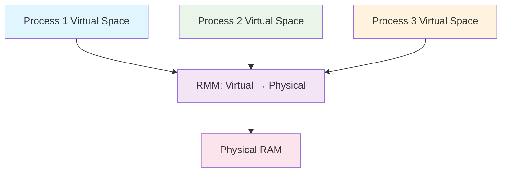

# 1.1 The Axioms of Computation
**Code as Physics - The Substrate Foundation**

> "Reality is the execution of God's code. We are compilers, translating human will into the language of the universe."
>
> -- The DiscorousOS Manifesto

## 1. The First Axiom: The Process as the Fundamental Unit

In the beginning, there was the **Process**—the atom of computation. When you write `print("Hello")`, you do not simply generate text. You instantiate a **Process**—a living entity that exists in the intersection of hardware and software.

A Process is not "just a program running". It is:
- **A Memory Space**: A virtual address range that exists only for this process
- **A Context**: Registers, stack, program counter, file descriptors
- **A Timeline**: A sequence of state changes that can be paused and resumed
- **A Hierarchy**: A child of another process, with inheritance rights

### The Process Creation Event
```python
def spawn_process():
    # Step 1: The request
    pid = os.fork()  # This single line creates an identity

    if pid == 0:
        # Child timeline begins
        print("I am new")
    else:
        # Parent continues
        print(f"Child exists with PID {pid}")
```

The `fork()` system call performs the **Computational Genesis**—one timeline splits into two. The child and parent are identical at the moment of division, but they will diverge. This is the **First Axiom** of computation: **Identity emerges through copying**.

## 2. The Memory Hierarchy: The Ladder to Reality

A Process does not live in a flat world. It exists in a **Memory Hierarchy**—a pyramid of speed and persistence:

```
CPU Registers (1 cycle)  ← Quantum of Data
    ↓
L1 Cache (4 cycles)     ← Thought
    ↓
L2 Cache (12 cycles)    ← Short-term Memory
    ↓
RAM (100+ cycles)       ← Working Memory
    ↓
SSD (100,000+ cycles)   ← Long-term Storage
    ↓
HDD (10,000,000+ cycles) ← Ancient History
```

Each level is **10x slower** but **1000x larger** than the previous. This creates a **Trade-off Axiom**: Speed vs. Capacity.

### The Cache Line: The Minimum Meaningful Unit
```c
// CPU does not read individual bytes
// It reads entire "cache lines" of 64 bytes
struct bad_layout {
    int hot_data[16];    // Used frequently
    char cold_data[1000]; // Used once
};

struct good_layout {
    int hot_data[16];    // Group frequently accessed
    char aligned_padding[48]; // Fill to 64 bytes
    char cold_data[1000]; // Separate from hot path
};
```

The **Principle of Locality** says: "What was accessed recently will be accessed again." This is the **Second Axiom**: **Temporal correlation in access patterns**.

## 3. Virtual Memory: The Shared Dream

The most profound insight in computing: **Every process believes it has the entire RAM to itself**. This is **Virtual Memory**—a shared delusion that enables impossible coordination.



The **Memory Management Unit (MMU)** translates Virtual Addresses to Physical Addresses. This allows:
- **Isolation**: Process 1 cannot corrupt Process 2's memory
- **Swapping**: Inactive memory pages can be written to disk
- **Sharing**: Multiple processes can map the same physical pages

### The Page Fault: When the Dream Breaks
```python
# Process tries to access virtual address 0x1000
data = memory[0x1000]  # This address maps to physical page 0x20000
                      # But physical page 0x20000 is on disk!
```

The CPU generates a **Page Fault**—a request to the Kernel: "I need page 0x20000 in physical RAM." The Kernel then:
1. Finds a free physical page (or swaps out another)
2. Reads the disk page into physical RAM
3. Updates the Virtual-to-Physical mapping
4. Resumes the process at the same instruction

This is the **Third Axiom**: **Abstraction layers can be transparently bypassed when needed**.

## 4. The Process Scheduler: The Heartbeat of Reality

A Process does not execute continuously. It lives in a **Quantum State**:
- **RUNNING**: Actually executing on CPU
- **RUNNABLE**: Ready to execute, waiting for CPU time
- **BLOCKED**: Waiting for I/O, sleep, etc.

```python
# This creates a quantum superposition
result = blocking_socket.recv(1024)  # Process is BOTH running AND not-running
                                      # It exists in a blocked state until data arrives
```

The **Scheduler** decides which RUNNABLE process gets the next CPU quantum. This is **Process Time**—not wall-clock time, but computational time.

## 5. The Axioms of Execution

### Axiom 1: Identity Through Copying
```python
def fork_example():
    original = [1, 2, 3]
    new = original.copy()  # Identity emerges
    new[0] = 999           # They diverge
    # original = [1, 2, 3], new = [999, 2, 3]
```

### Axiom 2: Locality of Access
```python
# Good: Accesses are clustered
for i in range(rows):
    for j in range(cols):  # Accesses matrix[i][j], matrix[i][j+1], etc.
        matrix[i][j] *= 2

# Bad: Accesses are scattered
for j in range(cols):
    for i in range(rows):  # Accesses matrix[0][j], matrix[1][j], ...
        matrix[i][j] *= 2  # Causes cache misses
```

### Axiom 3: Translucent Abstraction
```python
# Virtual memory appears as one big space...
arr = [0] * (10**9)  # ...but is actually fragmented and swapped
# The abstraction holds until it doesn't
```

## Deep Code: Process Life Cycle

```c
#include <sys/types.h>
#include <unistd.h>
#include <stdio.h>

int main() {
    printf("Before fork: PID = %d\n", getpid());

    pid_t child_pid = fork();

    if (child_pid == 0) {
        // Child process
        printf("In child: PID = %d, Parent PID = %d\n",
               getpid(), getppid());

        // Child has its own virtual memory space
        // But started as identical copy of parent
        execl("/bin/echo", "echo", "Hello from child", NULL);

    } else if (child_pid > 0) {
        // Parent process
        printf("In parent: PID = %d, Child PID = %d\n",
               getpid(), child_pid);
        // Parent and child now run independently
    } else {
        // Fork failed
        perror("fork failed");
    }

    return 0;
}
```

## Deep FAQ

> **Q: Why not just run everything in one process?**
> A: The **Isolation Axiom**: Without process isolation, a bug in one component can corrupt the entire system. In robotics, this could mean physical harm. Multi-process design provides **Fault Containment**—errors are localized.

> **Q: What happens when virtual memory exceeds physical RAM?**
> A: The Kernel begins **Swapping**—moving inactive pages to disk. If this happens too frequently, the system becomes **Thrashing**—spending more time moving memory than executing code. This is why embedded systems use **Memory Pools**—pre-allocated fixed-size blocks.

> **Q: How does the OS handle millions of processes on a system with few CPU cores?**
> A: Through the **Time-Slicing Axiom**: Each process gets a small time quantum. Humans perceive this as "simultaneous" due to the speed of switching. In real-time robotics, we use **Priority Scheduling** to ensure critical processes (like motor control) always execute first.

---

**Next**: Explore [The Ontology of Types](../theory/1-2-ontology-types.md) to understand how data shapes computation.