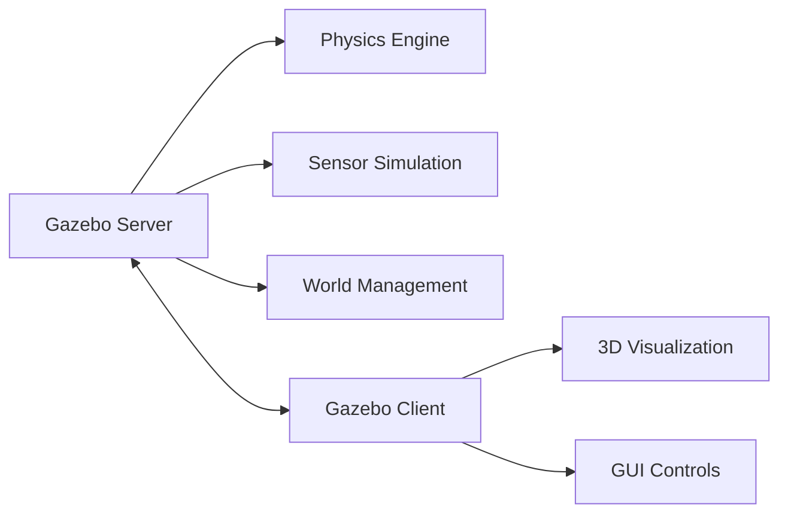

# Gazebo Simulation Environment

Gazebo is a powerful 3D robotics simulator that provides realistic physics simulation, sensor simulation, and a rich library of robot models.

## Why Simulation First?

Following IntelliStack's **Simulation Before Hardware** principle:

- ✅ **Safe testing**: No risk of damaging expensive hardware
- ✅ **Rapid iteration**: Test changes instantly without physical setup
- ✅ **Accessible**: No hardware required to start learning
- ✅ **Debugging**: Visualize internal states and sensor data
- ✅ **Scenarios**: Test edge cases and dangerous situations safely

## Gazebo Architecture



## Installing Gazebo Harmonic

```bash
# Add Gazebo repository
sudo apt-get update
sudo apt-get install lsb-release gnupg

sudo curl https://packages.osrfoundation.org/gazebo.gpg \
  --output /usr/share/keyrings/pkgs-osrf-archive-keyring.gpg

echo "deb [arch=$(dpkg --print-architecture) \
  signed-by=/usr/share/keyrings/pkgs-osrf-archive-keyring.gpg] \
  http://packages.osrfoundation.org/gazebo/ubuntu-stable \
  $(lsb_release -cs) main" \
  | sudo tee /etc/apt/sources.list.d/gazebo-stable.list > /dev/null

# Install Gazebo
sudo apt-get update
sudo apt-get install gz-harmonic

# Install ROS-Gazebo bridge
sudo apt install ros-humble-ros-gz
```

## Launch Your First Simulation

```bash
# Start Gazebo with empty world
gz sim empty.sdf

# Launch with a demo world
gz sim shapes.sdf

# ROS 2 + Gazebo bridge
ros2 launch ros_gz_sim gz_sim.launch.py gz_args:=empty.sdf
```

## Understanding SDF (Simulation Description Format)

### Basic World File

```xml
<?xml version="1.0" ?>
<sdf version="1.9">
  <world name="robot_world">
    <!-- Physics engine -->
    <physics name="1ms" type="ignored">
      <max_step_size>0.001</max_step_size>
      <real_time_factor>1.0</real_time_factor>
    </physics>

    <!-- Lighting -->
    <light type="directional" name="sun">
      <cast_shadows>true</cast_shadows>
      <pose>0 0 10 0 0 0</pose>
      <diffuse>0.8 0.8 0.8 1</diffuse>
      <specular>0.2 0.2 0.2 1</specular>
    </light>

    <!-- Ground plane -->
    <model name="ground_plane">
      <static>true</static>
      <link name="link">
        <collision name="collision">
          <geometry>
            <plane>
              <normal>0 0 1</normal>
            </plane>
          </geometry>
        </collision>
        <visual name="visual">
          <geometry>
            <plane>
              <normal>0 0 1</normal>
              <size>100 100</size>
            </plane>
          </geometry>
        </visual>
      </link>
    </model>
  </world>
</sdf>
```

## Creating a Simple Robot Model

```xml
<?xml version="1.0" ?>
<sdf version="1.9">
  <model name="simple_robot">
    <pose>0 0 0.5 0 0 0</pose>

    <!-- Robot body -->
    <link name="base_link">
      <inertial>
        <mass>10.0</mass>
        <inertia>
          <ixx>0.1</ixx>
          <iyy>0.1</iyy>
          <izz>0.1</izz>
        </inertia>
      </inertial>

      <!-- Visual (what you see) -->
      <visual name="visual">
        <geometry>
          <box>
            <size>0.5 0.3 0.2</size>
          </box>
        </geometry>
        <material>
          <ambient>0 0 1 1</ambient>
          <diffuse>0 0 1 1</diffuse>
        </material>
      </visual>

      <!-- Collision (for physics) -->
      <collision name="collision">
        <geometry>
          <box>
            <size>0.5 0.3 0.2</size>
          </box>
        </geometry>
      </collision>
    </link>

    <!-- Differential drive plugin -->
    <plugin
      filename="gz-sim-diff-drive-system"
      name="gz::sim::systems::DiffDrive">
      <left_joint>left_wheel_joint</left_joint>
      <right_joint>right_wheel_joint</right_joint>
      <wheel_separation>0.4</wheel_separation>
      <wheel_radius>0.1</wheel_radius>
    </plugin>
  </model>
</sdf>
```

## Controlling Robots in Simulation

### Python Control Script

```python
import rclpy
from rclpy.node import Node
from geometry_msgs.msg import Twist

class RobotController(Node):
    """Simple robot velocity controller."""

    def __init__(self):
        super().__init__('robot_controller')
        self.publisher = self.create_publisher(
            Twist,
            '/cmd_vel',
            10
        )
        self.timer = self.create_timer(0.1, self.timer_callback)
        self.get_logger().info('Robot controller started')

    def timer_callback(self):
        """Publish velocity commands."""
        msg = Twist()
        msg.linear.x = 0.5  # Forward velocity (m/s)
        msg.angular.z = 0.2  # Rotation velocity (rad/s)
        self.publisher.publish(msg)

def main(args=None):
    rclpy.init(args=args)
    controller = RobotController()
    rclpy.spin(controller)
    controller.destroy_node()
    rclpy.shutdown()

if __name__ == '__main__':
    main()
```

### Running the Controller

```bash
# Terminal 1: Start Gazebo simulation
gz sim robot_world.sdf

# Terminal 2: Run ROS-Gazebo bridge
ros2 run ros_gz_bridge parameter_bridge /cmd_vel@geometry_msgs/msg/Twist@gz.msgs.Twist

# Terminal 3: Run controller
python3 robot_controller.py
```

## Sensor Simulation

### Camera Sensor

```xml
<!-- Add to robot model -->
<sensor name="camera" type="camera">
  <pose>0.2 0 0.3 0 0 0</pose>
  <camera>
    <horizontal_fov>1.047</horizontal_fov>
    <image>
      <width>640</width>
      <height>480</height>
    </image>
    <clip>
      <near>0.1</near>
      <far>100</far>
    </clip>
  </camera>
  <always_on>1</always_on>
  <update_rate>30</update_rate>
  <visualize>true</visualize>
</sensor>
```

### LIDAR Sensor

```xml
<sensor name="lidar" type="gpu_lidar">
  <pose>0 0 0.3 0 0 0</pose>
  <lidar>
    <scan>
      <horizontal>
        <samples>360</samples>
        <resolution>1</resolution>
        <min_angle>-3.14159</min_angle>
        <max_angle>3.14159</max_angle>
      </horizontal>
    </scan>
    <range>
      <min>0.1</min>
      <max>30.0</max>
      <resolution>0.01</resolution>
    </range>
  </lidar>
  <update_rate>10</update_rate>
</sensor>
```

## Practice Exercises

### Exercise 1: Custom World

Create a world file with obstacles for robot navigation:

```xml
<!-- obstacle_world.sdf -->
<!-- Add boxes, cylinders, and walls -->
```

### Exercise 2: Teleoperation Node

Create a node that accepts keyboard input to control the robot:

```python
# teleop_keyboard.py
# Use 'w' for forward, 's' for backward, 'a'/'d' for turning
```

### Exercise 3: Sensor Subscriber

Write a node that subscribes to camera images and prints resolution:

```python
# camera_subscriber.py
```

## Key Takeaways

- ✅ Gazebo provides realistic physics simulation
- ✅ SDF files define worlds and robot models
- ✅ ROS-Gazebo bridge connects simulation to ROS 2
- ✅ Sensors can be simulated (camera, LIDAR, IMU)
- ✅ Test safely in simulation before real hardware

## Next Lesson

Continue to [Robot Navigation Basics](./navigation-basics) to learn SLAM and path planning!

## Additional Resources

- [Gazebo Documentation](https://gazebosim.org/docs)
- [ROS 2 Gazebo Tutorials](https://docs.ros.org/en/humble/Tutorials/Advanced/Simulators/Gazebo/Gazebo.html)
- [SDF Format Specification](http://sdformat.org/)
